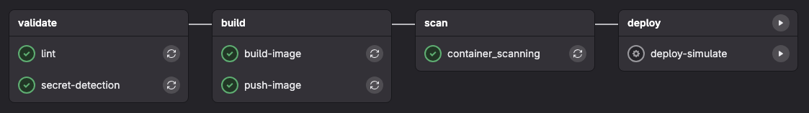

# CI/CD Assignments

These assignments build a single GitLab CI/CD pipeline **incrementally**. You will add one or two jobs per assignment so that by the end you have: secret detection, Java linting, Docker build, push to GitLab Container Registry, GitLab’s built-in container scanning, and a manually triggered deploy simulation.

**Repository:** Create a **new project** in your [student group on GitLab](https://gitlab.com/university-of-scranton/computing-sciences/courses/it-244/students). Name the project **`cicd-assignment`**. Use this repo for all CI/CD assignments. Each assignment asks you to add or edit **`.gitlab-ci.yml`** at the root of the repository.

**Branch and merge request workflow:**
- **Assignment 1:** Do the work on **`main`**. Push directly to `main`. No merge request.
- **Assignments 2–5:** For each assignment, create a **new branch** from `main` (e.g. `assignment-2`, `assignment-3`, …). Do the work on that branch, push the branch, then **open a merge request** from your branch into `main`. **Merge the merge request yourself** (you do not need a reviewer approval). I will look at the merge requests to see your work for each assignment.

**Submission:** For Assignment 1, push to `main` and ensure the pipeline runs. For Assignments 2–5, submit by merging your merge request into `main`; the merged MR is your submission.

---

## Prerequisites
**Starter project:** I have provided the [assignment-example](assignment-example/) folder from the course materials as a starter. Copy its contents (including `pom.xml`, `src/`, `Dockerfile`, `checkstyle.xml`, `.dockerignore`) into your `cicd-assignment` repo so you have a working Java app and Dockerfile from the start.

---

## Assignment 1: Secret detection with TruffleHog

**Branch:** Work on **`main`**. Push your changes directly to `main`. No merge request for this assignment.

**Goal:** Add a CI job that runs **TruffleHog** to scan the repository for committed secrets. The job should fail the pipeline if verified secrets are found.

**Tasks:**

1. In the root of your repo, create or edit **`.gitlab-ci.yml`**.
2. Define a single **stage** (e.g. `validate`) and one **job** (e.g. `secret-detection`).
3. Use the official TruffleHog Docker image. Set the image and clear the entrypoint so your `script` commands run correctly:
   ```yaml
   image:
     name: trufflesecurity/trufflehog:latest
     entrypoint: [""]
   ```
4. In `script`, run TruffleHog against the current repo. Typical usage:
   - `trufflehog git file://. --only-verified --fail`
   - `file://.` is the repo root; `--only-verified` reduces false positives; `--fail` makes the job fail if secrets are found.
5. Add a **rule** so this job runs on every pipeline (e.g. `rules: - if: $CI_COMMIT_BRANCH`).
6. Push and confirm the job runs. If TruffleHog finds nothing, the job should pass.

**Reference (TruffleHog in CI):** [Scanning in CI – TruffleHog](https://docs.trufflesecurity.com/scanning-in-ci)

**Deliverable:** `.gitlab-ci.yml` with a working `secret-detection` job. Pushed to `main`; pipeline runs on `main`.

---

## Assignment 2: Java code linting

**Branch and merge request:** Create a new branch from `main` (e.g. `assignment-2`). Do the work on that branch. Push the branch, open a **merge request** from your branch into `main`, then **merge the merge request** yourself. I will see the MR for this assignment.

**Goal:** Add a **lint** job that compiles the Java project and runs a linter (e.g. Checkstyle). This runs in the same or a new stage (e.g. still `validate`).

**Tasks:**

1. Ensure your repo has a Maven project and a Checkstyle (or other linter) plugin in `pom.xml`. Example (Checkstyle):
   ```xml
   <plugin>
     <groupId>org.apache.maven.plugins</groupId>
     <artifactId>maven-checkstyle-plugin</artifactId>
     <version>3.3.1</version>
     <executions>
       <execution>
         <phase>verify</phase>
         <goals><goal>check</goal></goals>
       </execution>
     </executions>
   </plugin>
   ```
2. In **`.gitlab-ci.yml`**, add a job (e.g. `lint`) that:
   - Uses a **Java/Maven image** (e.g. `maven:3-eclipse-temurin-17`).
   - Is in the same stage as `secret-detection`.
   - Runs: `mvn compile` and your linter (e.g. `mvn checkstyle:check` or `mvn verify`).
3. Use **cache** for Maven dependencies so repeated runs are faster:
   ```yaml
   cache:
     key: maven
     paths:
       - .m2/repository
   ```
4. Add a **rule** so the job runs on branch pipelines (e.g. `rules: - if: $CI_COMMIT_BRANCH`).
5. Push and confirm both `secret-detection` and `lint` run and pass.

**Deliverable:** `.gitlab-ci.yml` with `secret-detection` and `lint` jobs; pipeline green. Merged via merge request into `main`.

---

## Assignment 3: Build Docker image and push to GitLab Container Registry

**Branch and merge request:** Create a new branch from `main` (e.g. `assignment-3`). Do the work on that branch. Push the branch, open a **merge request** into `main`, then **merge it** yourself.

**Goal:** Add a **build** stage that builds a Docker image from your Dockerfile and a **push** job that logs into the GitLab Container Registry and pushes the image.

**Tasks:**

1. Add a second stage (e.g. `build`) after `validate`.
2. Add a job (e.g. `build-image`) that:
   - Uses **Docker** (e.g. `image: docker:24`).
   - Uses the **Docker-in-Docker service** (`services: - docker:24-dind`).
   - Sets `DOCKER_TLS_CERTDIR: "/certs"` in `variables`.
   - In `before_script`: log in to the GitLab registry: `docker login -u $CI_REGISTRY_USER -p $CI_REGISTRY_PASSWORD $CI_REGISTRY`.
   - In `script`: run `docker build -t $CI_REGISTRY_IMAGE:$CI_COMMIT_SHA .`, then `docker push $CI_REGISTRY_IMAGE:$CI_COMMIT_SHA` so the image is in the registry for the next job.
   - Restrict to the default branch if you want (e.g. `rules: - if: $CI_COMMIT_BRANCH == $CI_DEFAULT_BRANCH`).
3. Add a second job (e.g. `push-image`) that:
   - Also uses `docker:24` and `docker:24-dind`.
   - **before_script:** `docker login -u $CI_REGISTRY_USER -p $CI_REGISTRY_PASSWORD $CI_REGISTRY`.
   - **script:** Pull the image that `build-image` pushed (`docker pull $CI_REGISTRY_IMAGE:$CI_COMMIT_SHA`), tag it as `$CI_REGISTRY_IMAGE:latest`, then push both tags (or at least push `latest`). This way the “push” job is responsible for publishing the `latest` tag.
   - Use **`needs: [build-image]`** so it runs after `build-image`.

   So that the image exists in the registry for `push-image` to pull, **build-image** must both build *and* push the image with tag `$CI_COMMIT_SHA`. In `build-image`: after `docker build`, run `docker login` (same as above), then `docker push $CI_REGISTRY_IMAGE:$CI_COMMIT_SHA`. Then `push-image` only pulls, re-tags as `latest`, and pushes `latest`.
4. Ensure the project’s Container Registry is enabled. Push and confirm the image appears under **Deploy → Container Registry** (with both `$CI_COMMIT_SHA` and `latest` tags).

**Deliverable:** `.gitlab-ci.yml` with validate + build stages; image built and pushed to GitLab Container Registry. Merged via merge request into `main`.

---

## Assignment 4: Container scanning with GitLab’s built-in scanner

**Branch and merge request:** Create a new branch from `main` (e.g. `assignment-4`). Do the work on that branch. Push the branch, open a **merge request** into `main`, then **merge it** yourself.

**Goal:** Add a **scan** stage that uses **GitLab’s built-in container scanning** to scan the image you pushed to the GitLab Container Registry for vulnerabilities. GitLab uses Trivy under the hood and produces a vulnerability report (and optional artifacts).

**Tasks:**

1. Add a stage (e.g. `scan`) after `build` (if not already present).
2. **Include** GitLab’s container scanning template at the top of your `.gitlab-ci.yml` (under an `include:` key, or add to an existing `include:` list):
   ```yaml
   include:
     - template: Jobs/Container-Scanning.gitlab-ci.yml
   ```
   This provides a job named **`container_scanning`** (with an underscore).
3. **Override** the `container_scanning` job so that it:
   - Runs in your **scan** stage: `stage: scan`.
   - Runs only after the image is pushed: **`needs: [push-image]`**.
   - Runs only on the default branch: **`rules: - if: $CI_COMMIT_BRANCH == $CI_DEFAULT_BRANCH`**.
   - Scans the image you pushed (same tag as Assignment 3). Set **`CS_IMAGE`** so the scanner uses your image. For example, if you push `$CI_REGISTRY_IMAGE:$CI_COMMIT_SHA`, set:
     ```yaml
     variables:
       CS_IMAGE: $CI_REGISTRY_IMAGE:$CI_COMMIT_SHA
     ```
4. Push and confirm the `container_scanning` job runs. Check the job log and (if available) the pipeline’s security report or artifacts for vulnerability findings.

**Deliverable:** `.gitlab-ci.yml` includes the container scanning template and overrides `container_scanning` with the correct stage, `needs`, `rules`, and `CS_IMAGE`. Merged via merge request into `main`.

**Reference:** [GitLab Container Scanning](https://docs.gitlab.com/ee/user/application_security/container_scanning/)

---

## Assignment 5: Manually triggered deploy simulation

**Branch and merge request:** Create a new branch from `main` (e.g. `assignment-5`). Do the work on that branch. Push the branch, open a **merge request** into `main`, then **merge it** yourself.

**Goal:** Add a **deploy** stage with a single job that **does not actually deploy** anything but only simulates a deploy (e.g. echo messages). This job must run **only when triggered manually** from the GitLab UI (Play button). It must not run automatically when the pipeline runs.

**Tasks:**

1. Add a final stage (e.g. `deploy`) after `scan`.
2. Add a job (e.g. `deploy-simulate`) that:
   - **stage:** `deploy`.
   - **script:** Only simulate deployment, e.g.:
     ```bash
     echo "Simulating deployment of $CI_REGISTRY_IMAGE:$CI_COMMIT_SHA"
     echo "Deploy step would run here (e.g. update Kubernetes, run Ansible)."
     ```
   - **when: manual** — so the job is created but not run until a user clicks “Play” on that job in the pipeline view.
   - **rules:** Restrict to the default branch (main) so it only appears there (e.g. `rules: - if: $CI_COMMIT_BRANCH == $CI_DEFAULT_BRANCH`).
3. Push and run a pipeline. Confirm that:
   - The deploy job appears in the pipeline with a “Play” (▶) button.
   - The job does **not** run automatically.
   - When you click “Play,” the job runs and prints your echo messages.

**Deliverable:** `.gitlab-ci.yml` with `deploy-simulate` and `when: manual`; evidence that the job runs only when manually triggered. Merged via merge request into `main`.

---

## Quick reference

**Branch and merge request per assignment:**

| Assignment | Branch      | Merge request into `main`? |
|------------|-------------|-----------------------------|
| 1          | `main`      | No — push directly to `main` |
| 2          | e.g. `assignment-2` | Yes — open MR, then merge it yourself |
| 3          | e.g. `assignment-3` | Yes — open MR, then merge it yourself |
| 4          | e.g. `assignment-4` | Yes — open MR, then merge it yourself |
| 5          | e.g. `assignment-5` | Yes — open MR, then merge it yourself |

**Pipeline order** when all assignments are done:

| Stage     | Jobs              | Trigger / notes                          |
|----------|-------------------|------------------------------------------|
| validate | secret-detection  | TruffleHog                               |
| validate | lint              | Maven + Checkstyle                       |
| build    | build-image       | Docker build                             |
| build    | push-image        | Push to GitLab Container Registry        |
| scan     | container_scanning | GitLab container scanning on pushed image |
| deploy   | deploy-simulate   | **Manual only** — simulate deploy        |

When you have completed all five assignments, your **executing pipelines** in GitLab should look like the following. Use this as a visual reference to confirm that the right stages and jobs appear and that the deploy step is available for manual trigger.



---

## Resources

- [GitLab CI/CD configuration](https://docs.gitlab.com/ee/ci/yaml/)
- [GitLab CI job control (when: manual)](https://docs.gitlab.com/ee/ci/jobs/job_control.html)
- [TruffleHog – Scanning in CI](https://docs.trufflesecurity.com/scanning-in-ci)
- [GitLab Container Scanning](https://docs.gitlab.com/ee/user/application_security/container_scanning/)
- [GitLab Container Registry](https://docs.gitlab.com/ee/user/packages/container_registry/)
